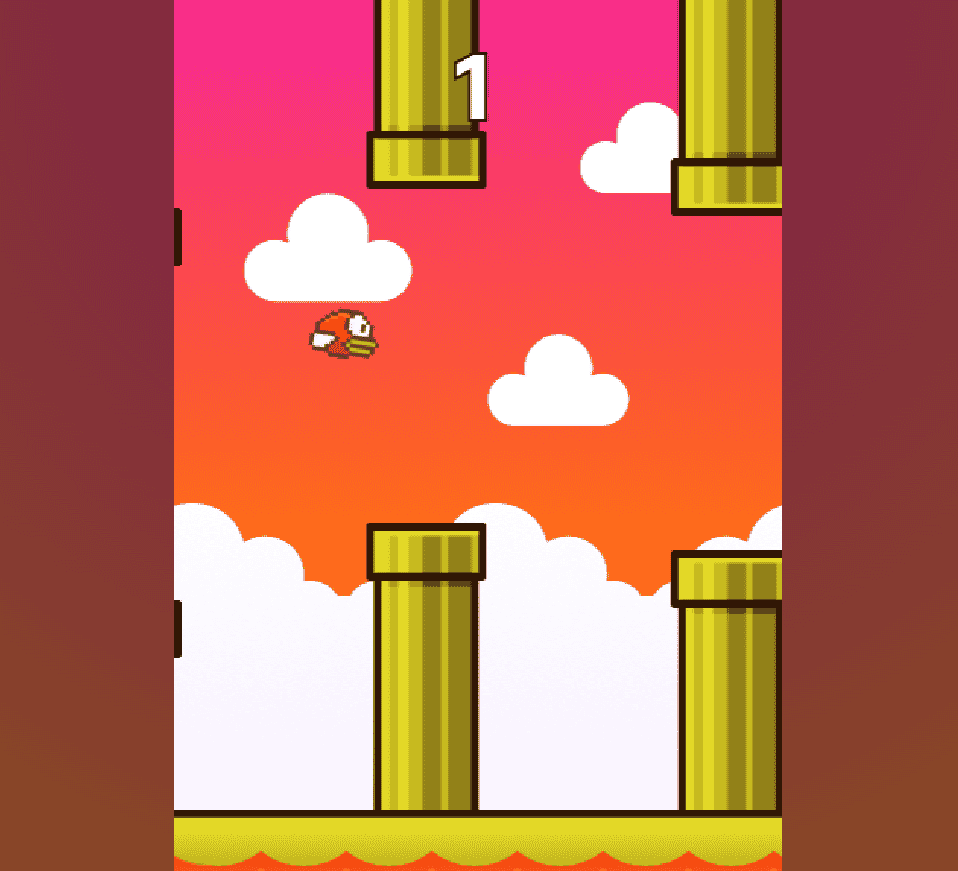

# 🐤 Flappy Bird - Retro Edition

A smooth, responsive, and retro-styled **Flappy Bird clone** made with pure HTML5, CSS, and JavaScript.

## 🎮 Features

- Responsive canvas-based gameplay
- Retro arcade pixel style & outlines
- Mobile support with touch controls
- Local high score storage
- Smooth animations & pipe mechanics
- Offline support as a **Progressive Web App (PWA)**

## 📸 Preview

  

## 📦 Try it Live

🔗 [https://semant.is-a.dev/flappy-bird](https://semant.is-a.dev/flappy-bird)

## 🧱 Tech Stack

* HTML5 `<canvas>`
* CSS3 (Retro styling, gradients, shadows)
* JavaScript (No frameworks)
* LocalStorage (for best score)
* Service Worker (PWA support)

## 📱 PWA Support

You can install the game to your home screen and play **offline** after first load. Works on both desktop and mobile!

## 🤝 Contributing

Pull requests are welcome! Feel free to suggest fun new features or improvements.

## 📜 License

MIT License
